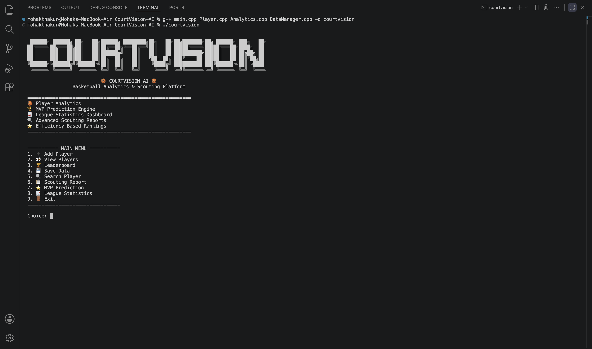
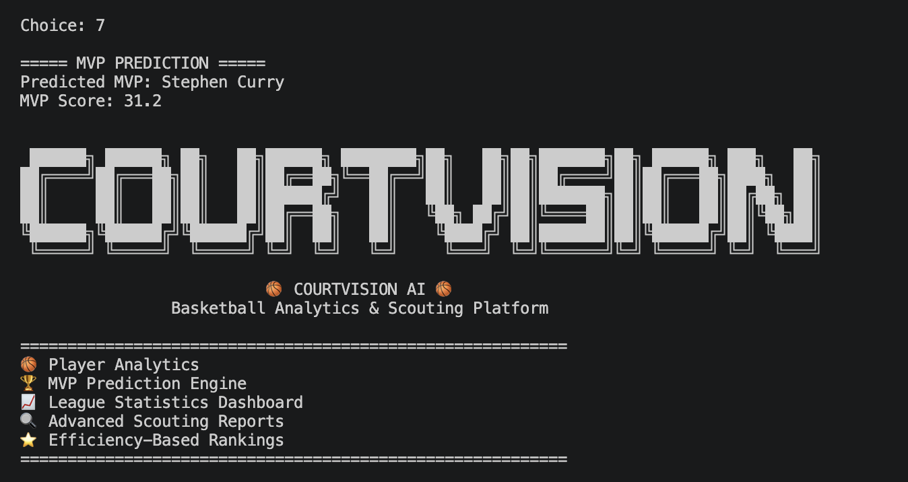
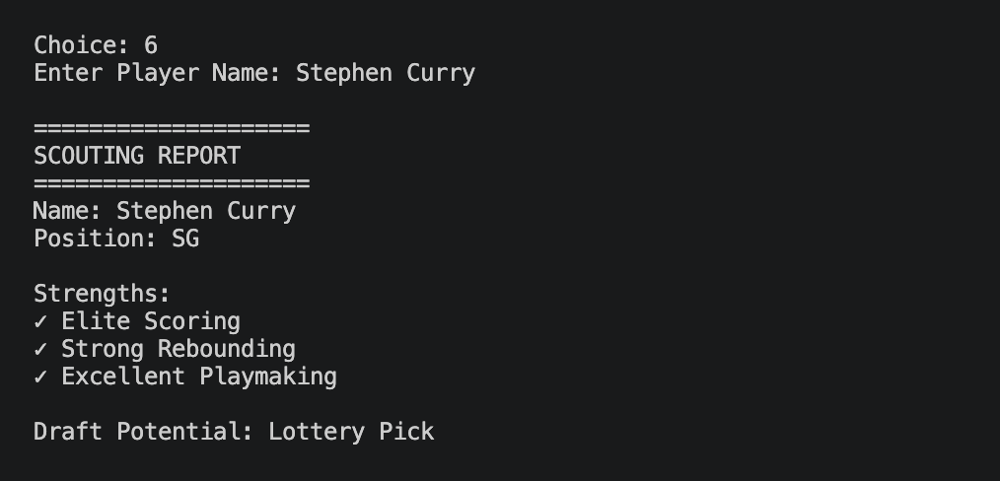
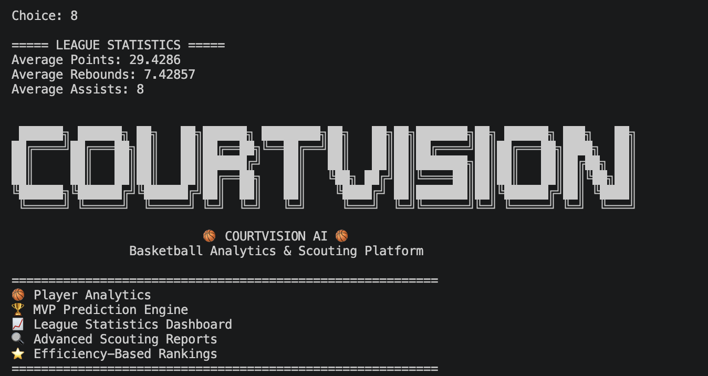

# 🏀 CourtVision

<div align="center">

```text
 ██████╗ ██████╗ ██╗   ██╗██████╗ ████████╗██╗   ██╗██╗███████╗██╗ ██████╗ ███╗   ██╗
██╔════╝██╔═══██╗██║   ██║██╔══██╗╚══██╔══╝██║   ██║██║██╔════╝██║██╔═══██╗████╗  ██║
██║     ██║   ██║██║   ██║██████╔╝   ██║   ██║   ██║██║███████╗██║██║   ██║██╔██╗ ██║
██║     ██║   ██║██║   ██║██╔══██╗   ██║   ╚██╗ ██╔╝██║╚════██║██║██║   ██║██║╚██╗██║
╚██████╗╚██████╔╝╚██████╔╝██║  ██║   ██║    ╚████╔╝ ██║███████║██║╚██████╔╝██║ ╚████║
 ╚═════╝ ╚═════╝  ╚═════╝ ╚═╝  ╚═╝   ╚═╝     ╚═══╝  ╚═╝╚══════╝╚═╝ ╚═════╝ ╚═╝  ╚═══╝
```

### 🏀 Basketball Analytics & Scouting Platform


Built with **C++ • OOP • STL • File Handling**

</div>

---

## 🚀 Overview

CourtVision is a basketball analytics platform built in C++ that enables player performance tracking, scouting analysis, MVP prediction, efficiency-based rankings, and league-wide statistical insights.

Designed using Object-Oriented Programming principles, the project demonstrates modular architecture, data persistence, STL containers, sorting algorithms, and sports analytics concepts.

---

## ✨ Key Features

### 🏀 Player Management
- Add player profiles
- Store advanced basketball statistics
- View complete player information

### 🏆 Leaderboard Engine
- Efficiency-based player rankings
- Automatic sorting using STL algorithms
- Real-time performance comparison

### 🔍 Player Search
- Find players instantly
- View detailed statistics and efficiency metrics

### 📄 Scouting Reports
- Analyze player strengths
- Generate draft projections
- Evaluate player potential

### ⭐ MVP Prediction Engine
- Calculates weighted MVP scores
- Identifies top-performing players
- Performance-driven ranking model

### 📊 League Statistics Dashboard
- Average points per game
- Average rebounds per game
- Average assists per game
- League-wide performance analytics

### 💾 Data Persistence
- Save player database locally
- Load previous sessions automatically
- File handling implementation

---

## 📸 Screenshots

### 🏠 Main Menu



### 🏆 MVP Prediction Engine



### 📋 Scouting Report



### 📊 League Statistics Dashboard



---

## ⚙️ Installation

```bash
g++ main.cpp Player.cpp Analytics.cpp DataManager.cpp -o courtvision
./courtvision
```
> Tested on macOS using g++ compiler.

## 🛠️ Technologies Used

| Technology | Purpose |
|------------|----------|
| C++ | Core Development |
| OOP | Software Architecture |
| STL | Data Structures & Algorithms |
| File Handling | Data Persistence |
| Sorting Algorithms | Leaderboard Ranking |
| Console UI | User Interface |

---

## 📂 Project Structure

```text
CourtVision
│
├── main.cpp
├── Player.h
├── Player.cpp
│
├── Analytics.h
├── Analytics.cpp
│
├── DataManager.h
├── DataManager.cpp
│
├── players.txt
└── README.md
```

---

## 🧠 Analytics Included

### MVP Formula

```text
MVP Score =
(Points × 0.5)
+ (Rebounds × 0.2)
+ (Assists × 0.3)
```

### Efficiency Formula

```text
Efficiency =
Points
+ Rebounds
+ Assists
+ (Steals × 2)
+ (Blocks × 2)
```

---

## 🎯 Learning Outcomes

This project demonstrates:

✅ Object-Oriented Programming

✅ Class Design & Encapsulation

✅ Modular Software Architecture

✅ File Handling

✅ STL Vectors

✅ Sorting Algorithms

✅ Search Algorithms

✅ Sports Analytics Concepts

✅ Data-Driven Decision Making

---

## 🚀 Future Improvements

- Team Analytics
- Player Comparison System
- CSV Export
- Advanced Efficiency Metrics
- Shot Efficiency Analytics
- Graphical Dashboard
- NBA Data Integration

---

## 👨‍💻 Author

### Mohak Thakur

🏀 State-Level Basketball Player  
💻 CSE (AI & Data Science) Student  
🚀 Aspiring Software Engineer

---

## ⭐ Support

If you found this project interesting, consider giving it a star.
